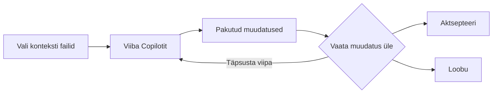

## Samm 3: Töö tegemine veelgi _kiiremini_ Copilot Muuda režiimiga

Eelmistes sammudes kasutasime Copiloti funktsioone, mis nõuavad rohkem käsitsi juhendamist ja tootsid enamasti lokaalseid tulemusi. Nüüd uurime Copilot **Muuda režiimi**, funktsiooni, mis võimaldab töötada terviklikumalt meie repos.

### 📖 Teooria: Copilot Muuda režiim

Copilot **Muuda režiim** ja **Agent režiim** mõlemad lubavad rakendada **loomulik keele** poolt juhitud muudatusi **mitmes failis**, kuid nende vahel on mõned erinevused.

Selles sammus keskendume **Muuda režiimile** ja uurime **Agent režiimi** järgmises sammus.

Muuda režiimi on parim kasutada **hästi määratletud** ülesannete jaoks, kus **tead muudatuste ulatust**.

#### Kuidas Muuda režiim töötab



1. **Määra kontekst**: Vali failid, mida Copilot peaks oma muudatustes arvestama
1. **Viiba Copilotit**: Kasuta loomulikku keelt vajalike muudatuste kirjeldamiseks.
1. **Vaata muudatused üle**: Näe pakutud muudatusi otse oma koodis.
1. **Aktsepteeri või loobu**: Vaata iga soovitatud muudatus üle ja vali, millised alles hoida.
1. **Itera**: Vajadusel anna järeljuhiseid muudatuste täpsustamiseks.

### :keyboard: Tegevus: Kasuta Copilotit uue funktsiooni lisamiseks! :rocket:

Meie veebileht loetleb tegevusi, aga hoiab külaliste nimekirja saladuses 🤫 

Kasutame Copilotit veebilehe muutmiseks, et kuvada iga tegevuse all registreerunud õpilasi!

1. Copilot Chat akna allosas kasuta rippmenüüd **Muuda** režiimile lülitumiseks.

   

1. Ava meie veebilehega seotud failid ja lohista iga redaktori aken (või fail) vestluspaneeli, teavitades Copilotit neid kontekstina kasutama.

   - `src/static/app.js`
   - `src/static/index.html`
   - `src/static/styles.css`

   

   > 💡 **Vihje:** Saad kasutada ka **Add Context...** nuppu teiste kontekstiüksuste lisamiseks, nagu GitHubi issue, terve koodibaas või terminaliakna tulemused.

1. Palu Copilotil uuendada meie projekti tegevuste praeguste osalejate kuvamiseks. Oota hetk, kuni muudatussoovitused saabuvad ja rakendatakse.

   > 
   >
   > ```prompt
   > Hei Copilot, kas saad palun muuta tegevuskaarte, et lisada osalejate sektsioon.
   > See näitab, millised osalejad on juba sellele tegevusele registreeritud täpploendina.
   > Ära unusta seda ilusaks teha!
   > ```

   - Failinimede ja avatud redaktoriakende kõrvale on ilmunud lisaikoon, mis näitab, et neil on soovitatud muudatusi.
   - Redaktoriakna paremasse alumisse nurka on ilmunud soovitatud muudatuste paneel, mis pakub juhtnuppe soovitatud muudatuste juurde hüppamiseks.

      

      


1. Enne muudatuste lihtsalt aktsepteerimist kontrolli palun meie veebilehte uuesti ja veendu, et kõik on ootuspäraselt uuendatud. Siin on näide uuendatud tegevuskaardist. Võib-olla pead rakenduse taaskäivitama või lehe värskendama.

   

   > 🪧 **Märkus:** Sinu tegevuskaart võib erinev välja näha. Copilot ei tooda alati samu tulemusi.

   <details>
   <summary>Vajad abi? 🤷</summary><br/>
   Kui veebileht ei laadi, kontrolli järgmist.

   - Taaskäivita VS Code'i silur, et veenduda veebilehe viimase versiooni teenindamises.
   - Kui unustasid url-i või sulgesid akna, vaata palun sammu 1.
   - Proovi veebilehte tugevalt värskendada või ava privaataknas, et see laadiks värske koopia.

   </details>

1. Nüüd, kui oleme kinnitanud, et meie muudatused on head, kasuta paneeli iga soovitatud muudatuse läbimiseks ja vajuta **Keep** muudatuse rakendamiseks.

   > 💡 **Vihje:** Saad muudatused otse aktsepteerida, neid muuta või anda lisajuhiseid nende täpsustamiseks vestlusliidese kaudu.

1. Meie uue funktsiooni valmides palun **commit'i** ja **saada** muudatused GitHubi.

1. Oota hetk, kuni Mona kontrollib sinu tööd, annab tagasisidet ja jagab järgmist tundi.


<details>
<summary>Probleeme? 🤷</summary><br/>

Kui sa ei saa tagasisidet, kontrolli järgmist:

- Veendu, et commit'isid muudatused `src/static/` kaustas harusse `accelerate-with-copilot` ja saatsid/sünkroniseerisid GitHubi.
- Kui Mona leidis vea, tee lihtsalt parandus ja saada muudatused uuesti. Mona kontrollib sinu tööd nii mitu korda kui vaja.

</details>
